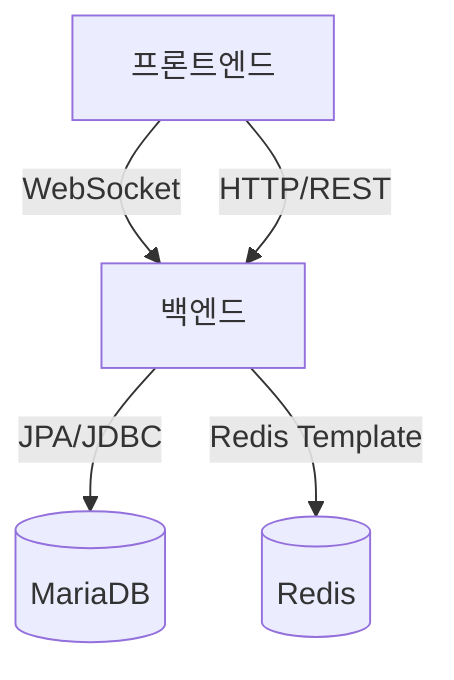
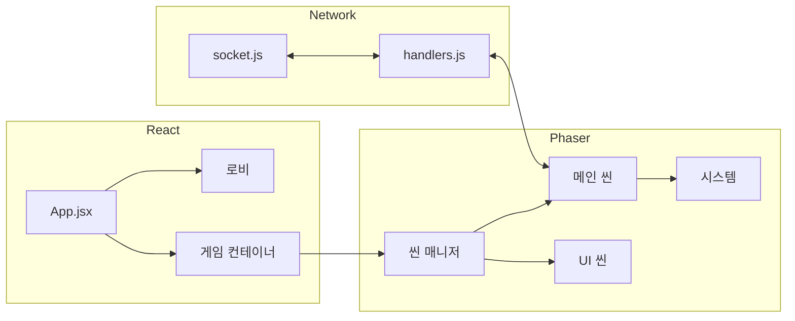
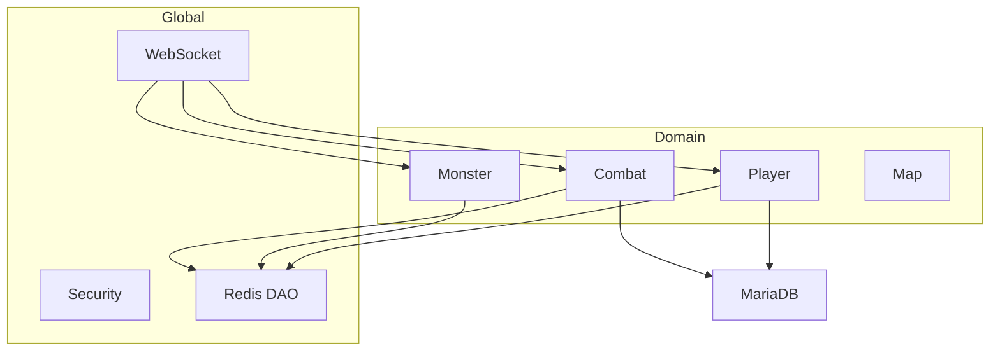
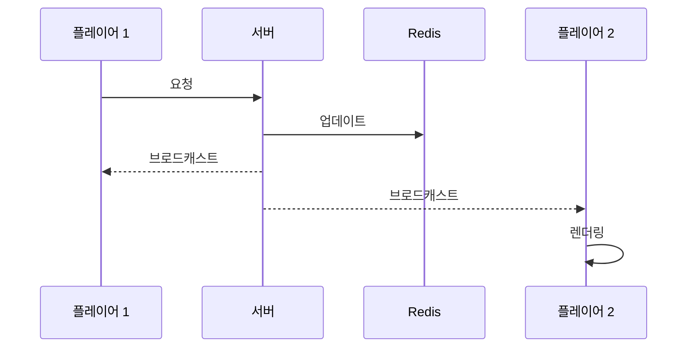
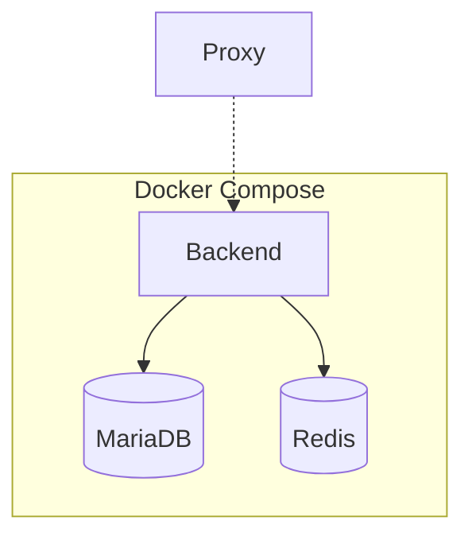

```mermaid
graph TD
    Client["프론트엔드"]
    Server["백엔드"]
    DB[("MariaDB")]
    Cache[("Redis")]

    Client -- "WebSocket" --> Server
    Client -- "HTTP/REST" --> Server
    Server -- "JPA/JDBC" --> DB
    Server -- "Redis Template" --> Cache
```

```mermaid
graph LR
    subgraph "React"
        App[App.jsx]
        Lobby[로비]
        GameContainer[게임 컨테이너]
    end

    subgraph "Phaser"
        SceneManager[씬 매니저]
        MainScene[메인 씬]
        UIScene[UI 씬]
        Systems["시스템"]
    end

    subgraph "Network"
        Socket["socket.js"]
        Handlers["handlers.js"]
    end

    App --> Lobby
    App --> GameContainer
    GameContainer --> SceneManager
    SceneManager --> MainScene
    SceneManager --> UIScene
    MainScene --> Systems
    Socket <--> Handlers
    Handlers <--> MainScene
```

```mermaid
graph TD
    subgraph "Global"
        Security["Security"]
        WebSocketConfig["WebSocket"]
        RedisDAO["Redis DAO"]
    end

    subgraph "Domain"
        combat["Combat"]
        monster["Monster"]
        player["Player"]
        map["Map"]
    end

    WebSocketConfig --> combat
    WebSocketConfig --> monster
    WebSocketConfig --> player
    
    combat --> RedisDAO
    monster --> RedisDAO
    player --> RedisDAO
    
    combat --> DB[MariaDB]
    player --> DB
```

```mermaid
sequenceDiagram
    participant P1 as 플레이어 1
    participant S as 서버
    participant R as Redis
    participant P2 as 플레이어 2

    P1->>S: 요청
    S->>R: 업데이트
    S-->>P1: 브로드캐스트
    S-->>P2: 브로드캐스트
    P2->>P2: 렌더링
```

```mermaid
graph TD
    subgraph "Docker Compose"
        AppContainer["Backend"]
        MariaDBContainer[("MariaDB")]
        RedisContainer[("Redis")]
    end

    AppContainer --> MariaDBContainer
    AppContainer --> RedisContainer
    
    Proxy["Proxy"] -.-> AppContainer
```
